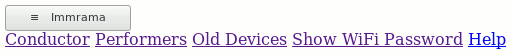
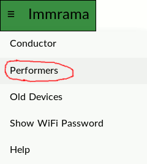

# Immrama - Android Performers

## Preparing your smartphone or tablet

Any device with a web browser can be used to view the score. Users who have smartphones
are advised to take a few steps before performances or rehearsals.

* Set the device to silent
* Disable receiving SMS and phone calls
* Turn off mobile data
* Ensure that WiFI is turned on
* Set a long delay before the screen turns off
* Consider disabling your device password
* Ensure your device is fully charged
* The Chrome browser and the Firefox browser both work better than the app named 'Browser'. Please install either of these browsers.

## Joining the network

* Join the Immrama wifi network.
* The wifi password is `12345678`
    *   If this changes, write it down.
* Smart phone users may see a prompt to log in via a web browser. Follow this prompt.
* Some users will see a '...' menu at the top right of the 'sign into network' app. Those users should select 'use this network as is'.
* Users should then open a fully-featured browser and connect to one of the following URLs:
    *   [http://immrama.local](http://immrama.local)
    *   [http://immrama](http://immrama)
    *   [http://immrama.home](http://immrama.home)
    *   [http://immrama.localnet](http://immrama.localnet)
    *   [http://172.24.1.1](http://172.24.1.1)
    *   [http://kent.ac.uk](http://kent.ac.uk)

## Opening the Piece

1. Once logged in, users should see a button on the top left of their screen.

  

2. Some users will see a button that has some text links
  by it or below it. Those users should click the `Old Devices` link and skip to step 6, or try a different web browser.

3. Tap the button. A drop down menu should appear.

4. If no menu opens, click on the `Old Devices` link near the bottom of the page and go to step 6, or try a different web browser.
5. Performers should click on the `Performers` link.
6. All Performers should then see a screen which says `Ready`.
7. Performers should use their web browser to make a bookmark of this page.
8. Some performers will see a small button on the top left corner. They may click it to select `Full Screen`.

  

9. To keep their screen from turning off, users can stroke the bottom of their screen gently throughout the piece.
10. Performers _should not_ click the `Conductor` link. You are on the honor system.

### Troubleshooting

When the piece is running, not everyone will see updates at the same time. If you do not see updates at all or if updates stop working after some period of time:

1. Make sure you are on the right wifi network. If your device allows you to say which devices you prefer,
put this one at the top of the list.
2. If your device keeps switching to another network (such as eduroam) and you can't get it to stop otherwise, tell it to forget the other network. In this case, you will need to forget the network before every performance or
rehearsal of the piece. When you rejoin the 'forgotten' network later, you will need to have the
password, etc as if you are a new user.
3. Your device may also switch to mobile data, so be sure this is disabled.
4. Check if you have javascript disabled. If so, enable it and reload the page.
5. If you still do not see updates, go back a page and select `Old Devices`. Be sure to update your bookmark.
